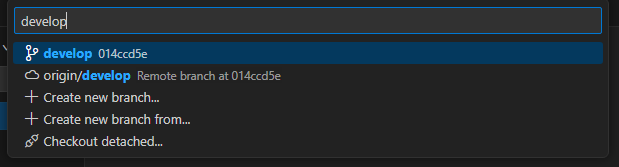

# Development Workflow

* [Set up your Development Environment](#markdown-header-set-up-your-development-environment)
* [Create and Checkout a Feature Branch](#markdown-header-create-and-checkout-a-feature-branch)
* [Stage your changes](#markdown-header-stage-your-changes)
* [Commit your changes](#markdown-header-commit-your-changes)
* [Push your changes](#markdown-header-push-your-changes)
* [Keep Up To Date With Development](#markdown-header-keep-up-to-date-with-development)
* [Pull Request](#markdown-header-pull-request)
    * [Creation](#markdown-header-creation)
    * [Review](#markdown-header-review)
    * [Merge](#markdown-header-merge)
* [Cleanup](#markdown-header-cleanup)
* [Promoting to Higher Environment](#markdown-header-promoting-to-higher-environment)

{height=10 width=10}

## Set up your Development Environment

If you haven't done so already, complete the steps defined
in [Setting up a Development Environment](./setting_up_dev_env.md). **If you experience any issues, the first
troubleshooting step will be to verify that you followed each of the steps in that document.**

## Create and Checkout a Feature Branch

### Feature Branch Naming Standards

An example feature branch name: `R2D-1234_Human-readable-description`

- The branch name shouldn't contain any spaces.
- `R2D-1234`: (Optional) Ticket Number.
- `_`: Include an underscore to separate it from the human-friendly description.
- `Human-readable-description`: You're going to forget what `R2D-1234` was. Include a word or two to help you remember
  what the work was about.

### Creating a Feature Branch

**VS Code**

1. Your current branch name is displayed in the bottom left-hand side of the window. Click on that to launch the
   branch-picker

   

2. Type in `dev`. If `dev` is an option, it means you have already checked that branch out.
   Select that.
   Otherwise, select `origin/dev`. The `dev` branch as it is in Bitbucket is referred to
   as `origin/dev`

   

3. Open the source control tray. If the button offers to "Sync Changes", click it to get the latest from Bitbucket

   

   If the button is disabled, you have the latest and can proceed to the next step

   

4. Click on your current branch name in the bottom left-hand side of the window to launch the branch-picker.
   Select `Create new branch...

   

5. Supply your name and press enter

   

**Terminal**

1. Check out the `dev` branch:
   ```bash
   git checkout dev
   ```
2. Ensure you're working on the latest version of the `dev` branch:
   ```bash
   git pull
   ```
3. Run `git status`. The output should read:
   > Your branch is up to date with 'origin/dev'.
   > nothing to commit, working tree clean
4. Create a "feature" branch from the `dev` branch.
   ```bash
   git checkout -b R2D-1234_Human-readable-description
   ```

## Stage your changes

Right now, your changes are "unstaged". There are two ways to stage your unstaged changes. You can stage new changes as
often as you want.

**VS Code**:

With the Source Control tray open, select the `+` to the right of the files under `Changes`

The changes are now staged, ready to commit

**Terminal**:
We should be execute below command,
to stage the files:

   ```bash
   git add .
   ```

to check the status:

   ```bash
   git status
   ```

They are ready to commit!

## Commit your changes

When you commit your changes, they become part of the history of the branch and repository. That's why a commit message
is required by git. You can commit as many times as you like. Experienced git practitioners commit often, as it provides
a checkpoint to return to and the commit messages tell a story. Start your commit message with the story number. For
example:

- `R2D-1234: implementing a`
- `R2D-1234: switching from a to b to avoid timeout error`
- `R2D-1234: refactoring b to c`

Future developers can follow this narrative to understand decisions that lack any other form of documentation.

**VS Code**:

In the message box above the `Commit` button, type a short message describing your changes


Press `Commit`. Your changes are ready to push!

**Terminal**:

Use the following command, replacing your commit message with the sample:

   ```bash
   git commit -m "<your commit message here>"
   ```

## Push your changes

Your changes aren't on Bitbucket yet. You need to push your commit from your local environment to Bitbucket, what git
calls the `origin`.

**VS Code**:

If this is your first push on your branch, you'll see this `Publish branch` button


If the branch has already been published to the `origin`, the button will read `Sync Changes` instead


**Terminal**:

Execute the following:

   ```bash
   git push --set-upstream origin R2D-1234_Human-readable-description
   ```

## Keep Up To Date With Development

When you created your branch, it was a copy of `dev`. Since that time, `dev` may have changed.
These changes could conflict with your changes and cause your work to be unable to merge. This is called a **merge
conflict**. Merge conflicts are easier to handle when they are small and recent. To keep your conflicts small and
recent, keep your branch up to date with the changes in `dev` by **merging** `dev` into your
feature branch. First, make sure all of your changes are committed to your feature branch and you have your feature
branch checked out.

**Terminal**:

Execute the following:

   ```bash
   git merge dev
   ```

## Pull Request

### Creation

1. Navigate to Bitbucket and select "Branches

   

2. Locate your branch and select the `Create` button under the `Pull Request` column to create a pull request

   

3. On the Create a Pull Request form

   

    - **Source Branch**: This should be the branch we created in earlier steps
    - **Destination Branch**: `dev`
    - **Title**: `R2D-1234: Human Readable Description`
    - **Description**: By default, this is just a bulleted list of your commit messages. Let's make it a bit more
      useful with:
    - **a link to the JIRA Story**
    - **a link to any unit testing documentation**
    - **Reviewer**: Assign two reviewers:
    - **The BA responsible for the changes**. They will need to confirm the content of the change.
    - **Someone from the development team**. They will confirm the file naming convention, the formatting, and
      the implementation of the SQL
    - **Delete Branch**: **Check the box to delete your branch when the pull request is merged.** If you don't do this,
      the repo will eventually have tons of old or "stale" branches.

4. Click `Create pull request`

Copy the pull request URL and share it with the reviewer to expedite the review process. Depending on their email
notification settings, they may not receive a notification that their review has been requested.

### Review

'Nuff said

### Merge


Bitbucket will prevent you from merging your pull request until it has been approved by 1 reviewer, but **you should
wait for approval from both the Dev and the BA before merging your pull request into `dev`**. Ensure the box
is checked to delete the feature branch after the merge.

## Cleanup

After the merge is completed, check out the `dev` branch on your local machine by following steps 1-3
of [Create and Checkout a Feature Branch](#markdown-header-create-and-checkout-a-feature-branch). Your changes should
now be reflected in the `dev` branch. Delete your feature branch

Delete your local feature branch

**VS Code**:

Press `Ctrl` + `Shift` + `P` to open up the command pallet.

Search for `delete` and select `Git: Delete Branch...


Select your feature branch: `R2D-1234_Human-readable-description


**Terminal**:

Use the following command:

   ```bash
   git branch -d R2D-1234_Human-readable-description
   ```

## Promoting to Higher Environment:

See [Environment Promotion](./environment_promotion.md) for instructions on how to promote the changes from `dev`
to `qa`.
