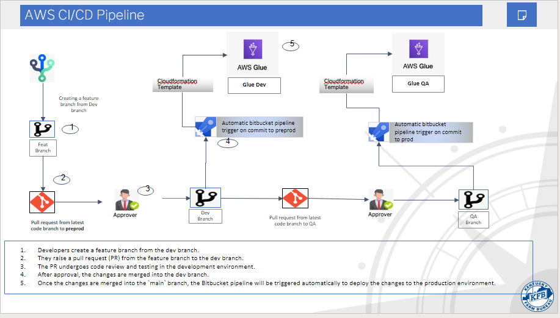

# Environment Promotion

## Deployment Workflow

### 1. **Feature Development**:

A feature branch is created and merged into the development branch via a Pull Request.
See [Development Workflow](development_workflow.md).

### 2. **Promoting from Development to QA**

The Development branch is merged into the QA branch and the QA branch is deployed to the QA environment

1. **Raise a Pull Request (PR)**:
   Raise a PR from the `dev` branch to the `qa` branch.
    - Include an informative title and description.
    - Assign reviewers

2. The PR undergoes code review and testing in the QA environment.

3. After approval, the PR is merged into the `qa` branch.

4. The [Bitbucket Pipeline](./../bitbucket-pipelines.yml) deploys changes to the QA environment. Monitor the [pipeline](https://bitbucket.org/kyfb_git/dataplatform_glue/deployments) to ensure that the changes are successfully deployed.

5. Perform manual environment testing to validate the changes in the QA environment.

### 3. **Promoting from QA to UAT2**

Follow the same process, creating the branch from the latest QA branch and targeting the UAT2 branch. 

### 4. **Promoting from UAT2 to PreProd**

Follow the same process, creating the branch from the latest UAT2 branch and targeting the PreProd branch.

### 5. **Promoting from PreProd to Prod**

Follow the same process, creating the branch from the latest PreProd branch and targeting the Prod branch.

## Conclusion

Following these steps will ensure a smooth and controlled promotion of changes from the development (dev) environment to
the QA environment. It is important to perform thorough testing and address any issues before proceeding with the
deployment to the QA environment.

Please refer to the architecture documentation for more information on the overall deployment process.  

