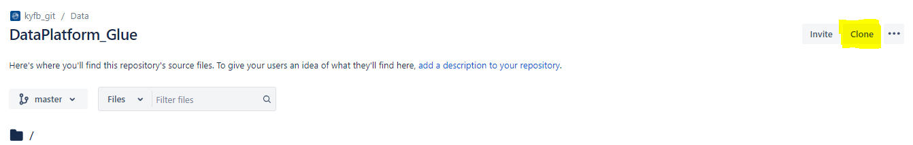
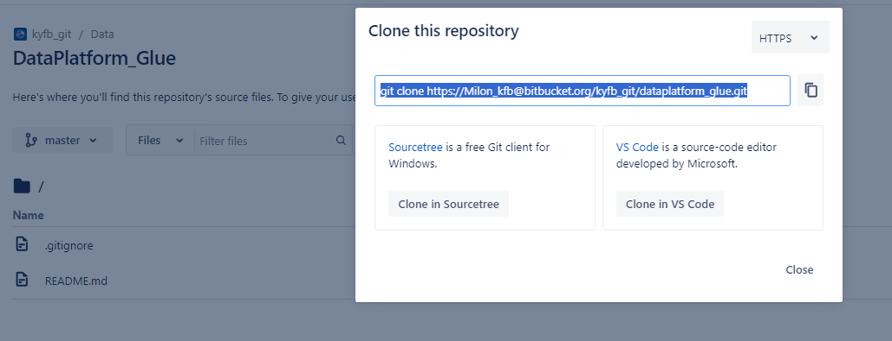
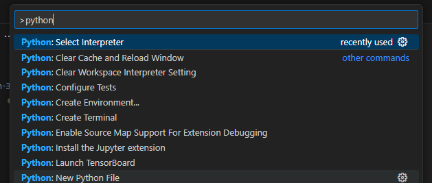

# Setting up a Development Environment

* [a) Register Netskope's Self-Signed Certificate](#markdown-header-a-register-netskopes-self-signed-certificate)
* [b) Create a BitBucket App Password](#markdown-header-b-create-a-bitbucket-app-password)
* [c) Configure git](#markdown-header-c-configure-git)
* [d) Clone the Repository](#markdown-header-d-clone-the-repository)
* [e) Install an IDE](#markdown-header-e-install-an-ide)
    * [Configuring VS Code](#markdown-header-configuring-vs-code)

Here's
a [link to a video walkthrough](https://kyfbmscloud.sharepoint.com/:v:/r/sites/ProjectManagementOffice/Shared%20Documents/Program-Cloud%20and%20GW%20Strategy/Release%202/Execution/Data/Design/Snowflake/CICD/Setting%20Up%20A%20Local%20Snowflake%20Development%20Environment-20231110_161146-Meeting%20Recording.mp4?csf=1&web=1&e=Q9ll8y&nav=eyJyZWZlcnJhbEluZm8iOnsicmVmZXJyYWxBcHAiOiJTdHJlYW1XZWJBcHAiLCJyZWZlcnJhbFZpZXciOiJTaGFyZURpYWxvZyIsInJlZmVycmFsQXBwUGxhdGZvcm0iOiJXZWIiLCJyZWZlcnJhbE1vZGUiOiJ2aWV3In19)
of this documentation.

## a) Register Netskope's Self-Signed Certificate

Netskope injects a self-signed certificate into the certificate chain of HTTPS traffic. This will cause a number of
tools to throw an error unless you register the certificate using a tool-specific environment variable:

- **AWS CLI**: AWS_CA_BUNDLE
- **Git**: GIT_SSL_CAINFO
- **Node**: NODE_EXTRA_CA_CERTS
- **Python**: REQUESTS_CA_BUNDLE

To register this self-signed certificate with the above tools, run the following script (courtesy
of [Tyler Ault](mailto:tyler.ault@kyfb.com)) **in a Powershell terminal. This won't work in a Command Prompt terminal**:

```shell
$cert = "C:\ProgramData\netskope\stagent\data\nscacert.pem"

[Environment]::SetEnvironmentVariable('AWS_CA_BUNDLE', $cert, 'User')
[Environment]::SetEnvironmentVariable('GIT_SSL_CAINFO', $cert, 'User')
[Environment]::SetEnvironmentVariable('NODE_EXTRA_CA_CERTS', $cert, 'User')
[Environment]::SetEnvironmentVariable('REQUESTS_CA_BUNDLE', $cert, 'User')
```

For more information,
see [Netskope HTTPS Cert Errors](https://kyfbmscloud.sharepoint.com/:w:/r/sites/InformationTechnology/_layouts/15/Doc.aspx?sourcedoc=%7BF8E14E10-2A0B-4BB8-9276-E9B9E605FDB1%7D&file=Netskope%20Cert%20error.docx&action=default&mobileredirect=true)

## b) Create a BitBucket App Password

Prerequisites:

- A BitBucket Account

1. Follow the
   steps <a href="https://support.atlassian.com/bitbucket-cloud/docs/create-an-app-password/" target="_blank">here</a>
   to create an App Password
    - **Label**: app_password
    - **Permissions**:
        - Repositories
            - Read
            - Write
            - Admin
            - Delete
        - Pull requests:
            - Read
            - Write
2. Store that password somewhere secure for future use. **You won't be able to view it again.**

## c) Configure git

Windows users should use [Git Bash](https://git-scm.com/download/win) or PowerShell for git operations. Git will require
a name and an email to be associated with each commit. Run the following command in a Powershell or Git
Bash terminal determine if you have already configured your name:
```bash
git config --global user.name "your name here, punctuation is fine"
```

Let's do the same for your email:
```bash
git config --global user.email "yourT123AB@kyfb.com"
```

## d) Clone the Repository

1. (Optional) If you don't already have one, create a local directory for git projects and navigate to that directory.
   ```bash
   mkdir ~/KYFB_Projects && cd ~/KYFB_Projects
   ```
2. Navigate to the [repo main page](https://bitbucket.org/kyfb_git/dataplatform_glue) and select the "Clone"
   button.
   
3. Select `HTTPS` on the dropdown in the upper right-hand side of the modal and copy the `git clone ...` string. **Don't
   clone the repo via Visual Studio Code** It won't prompt you for your app password, and you will be unable to
   commit to the repo
   
4. Add a colon after your bitbucket username and add the Bitbucket app password created
   in [b) Create a BitBucket App Password](#b-create-a-bitbucket-app-password). The string should look like this:
   ```bash
   git clone https://{BitBucket Username}:{BitBucket Password}@bitbucket.org/kyfb_git/dataplatform_glue.git
   ```
5. Execute the `git clone ...` command.
6. Change directories into the cloned repo:
   ```shell
   cd dataplatform_glue
   ```
7. Execute the following command. It will ensure that future push / pull operations trust the self-signed certificate.
   ```bash
   git config --global http.sslCAInfo C:/ProgramData/netskope/stagent/data/nscacert.pem
   git config http.sslCAInfo C:/ProgramData/netskope/stagent/data/nscacert.pem
   ```

## e) Install an IDE

Install an IDE that can connect to Snowflake:

1. Visual Studio Code has an official Snowflake Connector. You can install it from the following KFB
   path: `\\kfbsoftware\desktop\User\UserDEV\Microsoft\VisualStudio\VisualStudioCode`


### Configuring VS Code

1. Enable [Autosave](https://code.visualstudio.com/docs/editor/codebasics#_save-auto-save).
2. Install the [Snowflake Extension](https://marketplace.visualstudio.com/items?itemName=snowflake.snowflake-vsc)
3. Install the [Python Extension](https://marketplace.visualstudio.com/items?itemName=ms-python.python)
4. Install the [GitLens Extension](https://marketplace.visualstudio.com/items?itemName=eamodio.gitlens)
    - After you install this extension, select `Ctrl` + `Shift` + `P` and search for `GitLens: Hide Pro Features`.
      Select this. It will ensure that you don't click on a button only to be disappointed by a pay wall.

## f) Install Python Dependencies

1. Install Python 3.10.7 from the following shared drive: `\\kfbsoftware\desktop\User\UserDEV\Python\OLD`. **Don't
   install anything newer than 3.10. **During the installation, ensure that you add Python to PATH.** There's an option
   to do so in the first step of the process.
   
2. (Optional) Create a virtual environment. If you are using Python for multiple projects on your computer, you can end
   up with conflicting dependencies. For example, Project A wants 1.1.1 and Project B wants 1.2.3. You can support both
   requirements with [virtual environments](https://docs.python.org/3/library/venv.html) for each project. Each virtual
   environment has an independent set of Python packages. While working on Project A, you have access to the required
   1.1.1 dependency. While working on Project B, you have access to the required 1.2.3 dependency.
    1. Using Powershell, navigate to the `dataplatform_sf` directory.
    2. Create a virtual environment. This will create a `.venv` folder in the directory that will house your Python
       dependencies.
       ```bash
       python -m venv .venv
       ```
    3. Manually activate the virtual environment. When a virtual environment is activated, your terminal will have
       display the name of the virtual environment to the left of the prompt. The command will depend on which terminal
       you are using.
       
        - Powershell: `.venv\Scripts\Activate.ps1`
        - cmd: `.venv\Scripts\activate.bat`
    4. To automatically activate your virtual environment, register your virtual environment with your IDE:
        * VS Code:
            1. Open the Command Palette (Ctrl+Shift+P)
            2. Find and select "Python: Select Interpreter"
               
            3. Select the interpreter at the path `.\.venv\Scripts\python.exe`
            4. Now, every terminal you open with this project will automatically activate the virtual environment!
3. Ensure that you're using the latest version of pip:
   ```bash
   python.exe -m pip install --upgrade pip
   ```
4. Install Python dependencies. If you previously set up a virtual environment, ensure that it's active before you
   execute the following:
   ```bash
   pip install -r requirements.txt
   ```

## g) Configure credentials

The utilities in this repo need to authenticate with external services. If you hardcoded your passwords in the scripts,
you might forget to remove them prior to committing your work. This would expose your passwords to the organization or
worse. Instead, the utilities in this repo look to a `config.ini` file for credentials. Git has been configured to
ignore this file, so you won't accidentally commit your credentials.

1. Make a copy of the [example.ini](./../example.ini) file and name it `config.ini`.
2. Replace the credential placeholders with your credentials

## h) Configure AWS SSO

Configure SSO access to AWS

```bash
aws configure sso
```
